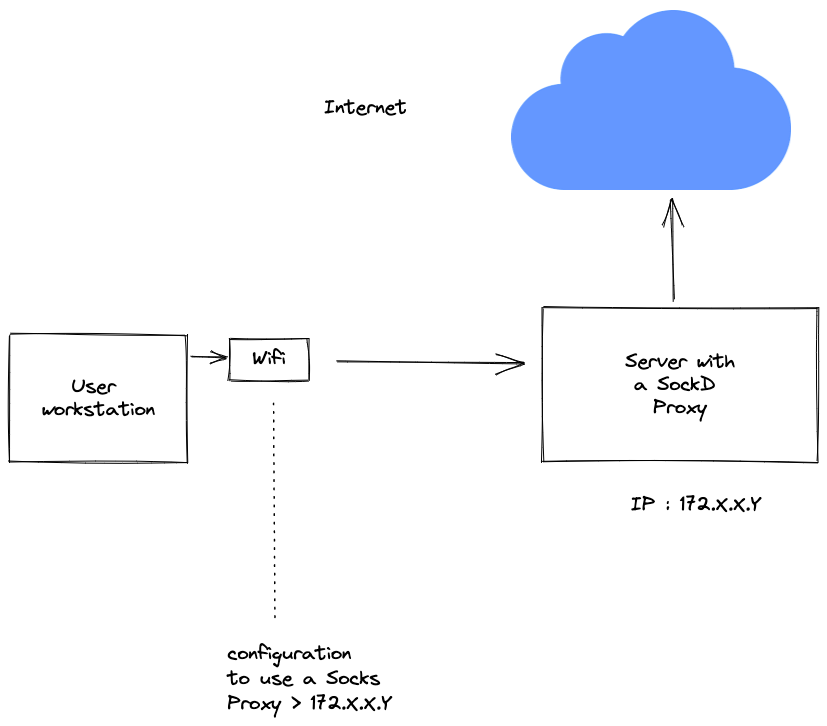

# A reverse proxy stack based on sockd

## What is this?

A socks proxy is a type of network proxy that creates a secure connection between the client and the server, routing network traffic through the proxy. This allows the client to access resources on the server as if they were directly connected, while hiding the client's IP address and providing an additional layer of security.

## What problem does a socks proxy solve?

The problem that a socks proxy solves is one of security and access. By routing network traffic through a secure proxy, a socks proxy can protect the client's IP address and provide an additional layer of security. This is especially useful for accessing resources on a server that is behind a firewall or in a different network. Additionally, a socks proxy can be used to bypass network restrictions and access resources that would otherwise be blocked.

## What is sockd

sockd is a SOCKS server that allows you to tunnel TCP connections through an SSH server. It is designed to be a lightweight alternative to other SOCKS servers, such as sshuttle, which require a full SSH client to be installed on the client machine.



## How to start with this stack ?

### Build the stack

```bash
docker-compose build
```

or

```bash
build.sh
```

### Start the stack

```bash
docker-compose up -d
```

or

```bash
up.sh
```

### How to configure your mac to use the proxy ?

You can use the script `configure_socks_proxy.sh` to configure your mac to use the proxy.

#### Usage
To use the script, open a terminal and run the following command:

```bash
./configure_socks_proxy.sh [options]
```

##### Options

The following options are available:

- -i or --interface: This option specifies the network interface to use the socks proxy for. For example: ./configure_socks_proxy.sh -i WI-FI.
- -proxy: This option specifies the socks proxy address and port such as 127.0.0.0:8080. For example: ./configure_socks_proxy.sh -proxy 127.0.0.0:8080.
- -h or --help: This option prints the help message.
- --remove: This option removes the configuration for the specified domain name.
  
##### Examples

Here are a few examples that show how to use the script:

- To set the proxy configuration for the WI-FI network interface:

```bash
./configure_socks_proxy.sh -proxy 127.0.0.0:8080
````

To remove the proxy configuration for the WI-FI network interface:

```bash
./configure_socks_proxy.sh --remove
```

### How to stop the stack ?

```bash
docker-compose down
```

or

```bash
down.sh
```

### Mention

Created with ❤️ by Raphaël MANSUY
````
